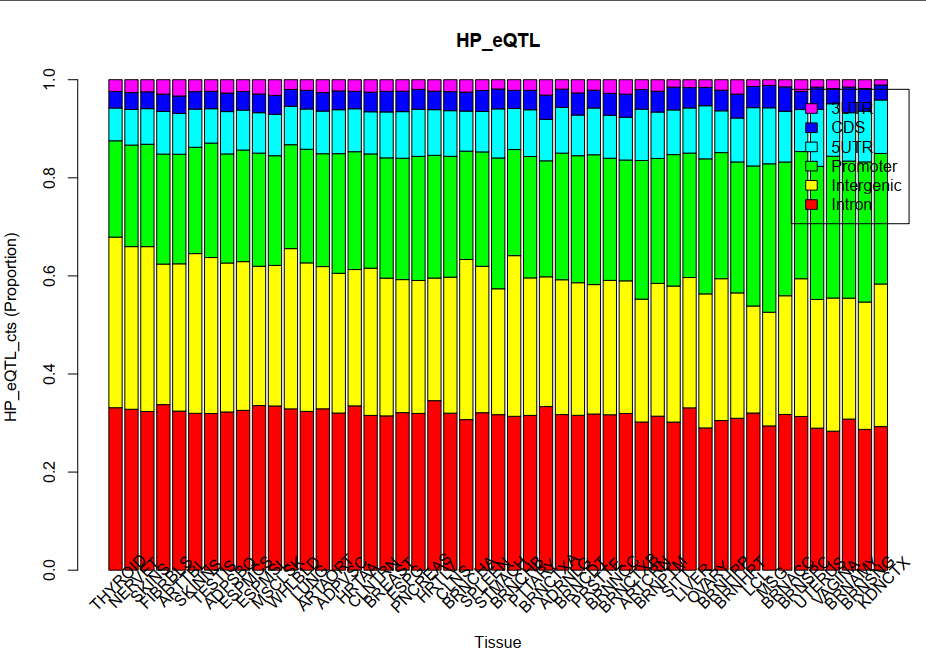
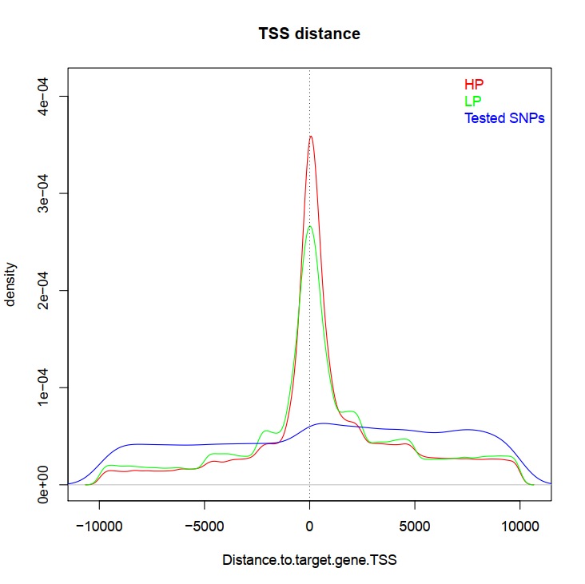

# Figure legends

## Section 1: genome wide distribution of genic eQTLs
### Figure 1a
{#fig:tall-image height=6in width=6in}

HP eQTL (PIP >= 0.5) in each of 49 tissues was annotated related to their associated genes based on the Gencode human gene annotations (v29) and split into 7 genome regions, the counts and proportion was obtained. Up1k means 1kbp upstream of gene TSS, other genome regions as name indicated.

### Figure 1b
{#fig:tall-image height=6in width=6in}
proportion of HP eQTL among all tested SNPs in Exons (including 5'UTR, CDS and 3'UTR), Introns and integenic regions upstream of TSS within 1-kbp genome regions with differnt distance to TSS was shown.    

{#fig:tall-image height=6in width=6in}

Comparison of PIP score distributions for eQTLs between exon and intron in each 1 kbp genomic regions ordered by distance to TSS within 30kbp considering most gene length <30kbp. Boxplot to show PIP score variations with outlies removed and PIP score for eQTL from 49 tissues pooled together

### Figure 1c
{#fig:tall-image height=3in}
### Figure 1d
{#fig:tall-image height=3in}

### Figure S1
{#fig:tall-image height=3in}

## Section 2: enrichment of genic eQTLs within transcription regulation related features
### Figure 2a
{#fig:tall-image height=3in}

HP eQTL enrichment within trnascrition related epigenetic mark peaks obtained from ENCODE project for 15 matched tissues. The different colors represent tissues matched between Gtex eQTL dataset and ENCODE dataset: Brain_Female. The enrichment odds ratio was obtained by comparison with MAF matched control SNPs randomly picked from all tested SNPs in Gtex dataset, error bar represent 95% confidence interval for log2 Odds ratio.

### Figure 2b
{#fig:tall-image height=3in}
### Figure 2c
{#fig:tall-image height=6in width=6in}

Here, 4 different epigenetic features in 4 matched tissues between Gtex and deepsea features presented, comparision between Control SNPs and HP eQTLs shown.

### Figure 2d
{#fig:tall-image height=3in}

### Figure S2
{#fig:tall-image height=3in}

## Section 3: enrichment of genic eQTLs within post-transcription regulation related features
### Figure 3a
### Figure 3b
### Figure 3c
### Figure 3d

### Figure S3

## Section 4: important post-transcription processes related to gene expression regulation
### Figure 4a
### Figure 4b
### Figure 4c
### Figure 4d

### Figure S4

