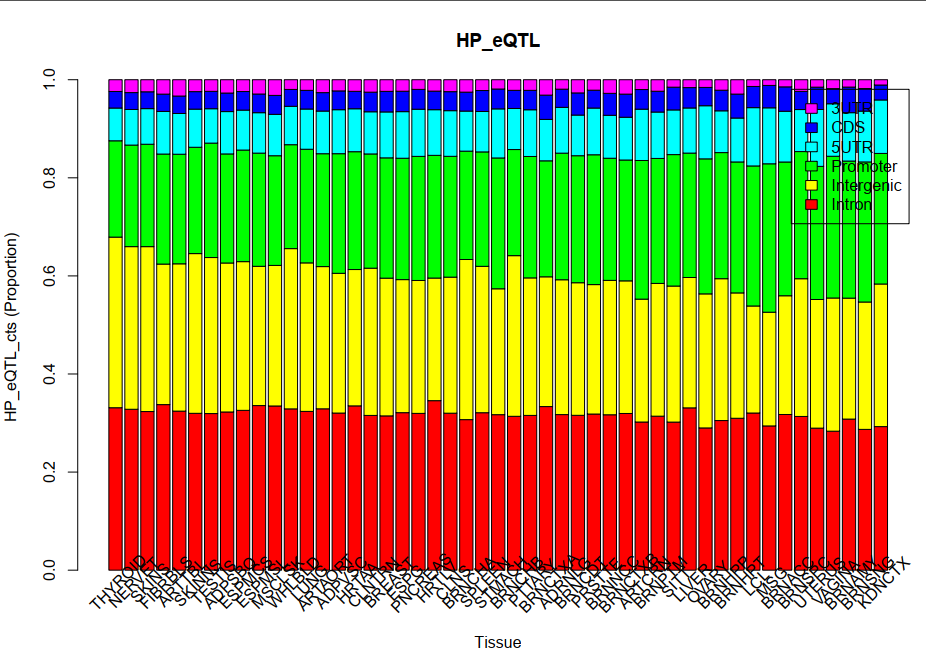
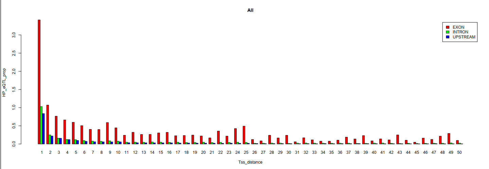
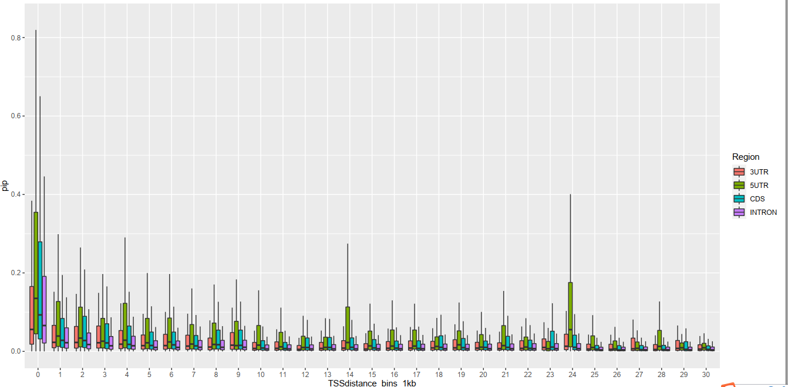
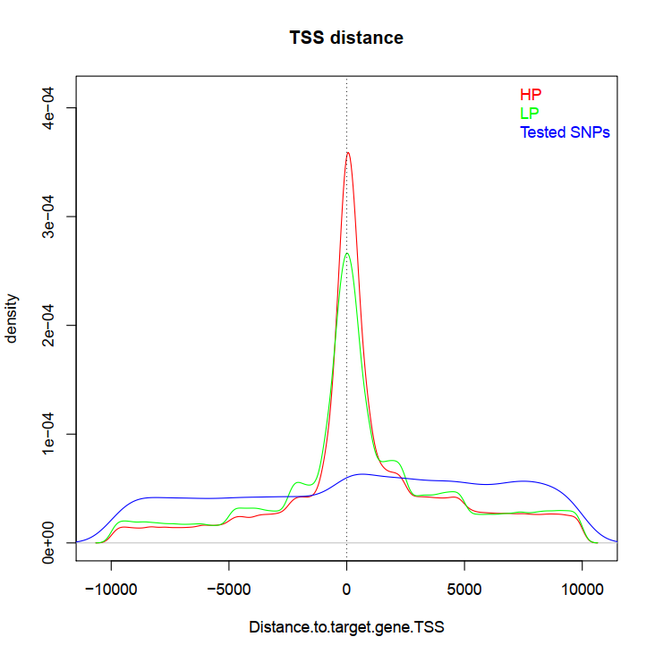
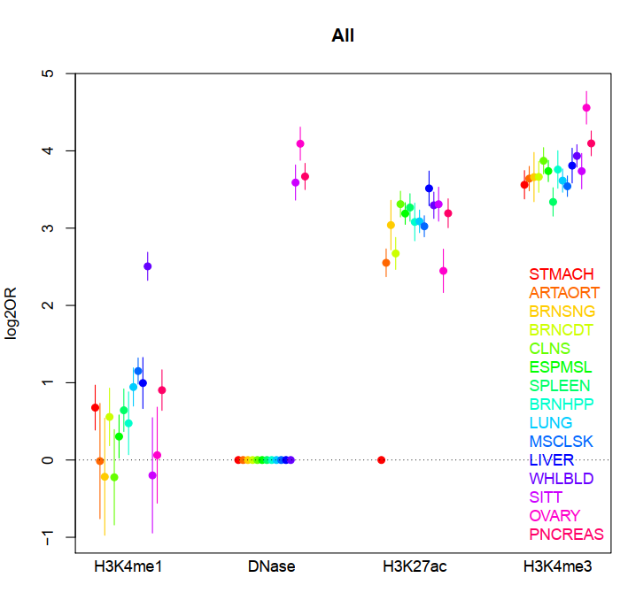
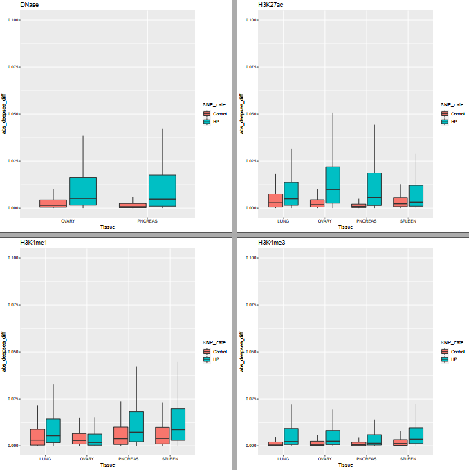

---
author-meta:
- John Doe
- Jane Roe
bibliography:
- content/manual-references.json
date-meta: '2020-08-19'
header-includes: '<!--

  Manubot generated metadata rendered from header-includes-template.html.

  Suggest improvements at https://github.com/manubot/manubot/blob/master/manubot/process/header-includes-template.html

  -->

  <meta name="dc.format" content="text/html" />

  <meta name="dc.title" content="Manuscript Title" />

  <meta name="citation_title" content="Manuscript Title" />

  <meta property="og:title" content="Manuscript Title" />

  <meta property="twitter:title" content="Manuscript Title" />

  <meta name="dc.date" content="2020-08-19" />

  <meta name="citation_publication_date" content="2020-08-19" />

  <meta name="dc.language" content="en-US" />

  <meta name="citation_language" content="en-US" />

  <meta name="dc.relation.ispartof" content="Manubot" />

  <meta name="dc.publisher" content="Manubot" />

  <meta name="citation_journal_title" content="Manubot" />

  <meta name="citation_technical_report_institution" content="Manubot" />

  <meta name="citation_author" content="John Doe" />

  <meta name="citation_author_institution" content="Department of Something, University of Whatever" />

  <meta name="citation_author_orcid" content="XXXX-XXXX-XXXX-XXXX" />

  <meta name="twitter:creator" content="@johndoe" />

  <meta name="citation_author" content="Jane Roe" />

  <meta name="citation_author_institution" content="Department of Something, University of Whatever" />

  <meta name="citation_author_institution" content="Department of Whatever, University of Something" />

  <meta name="citation_author_orcid" content="XXXX-XXXX-XXXX-XXXX" />

  <link rel="canonical" href="https://zhongshan2020.github.io/manubot_zsl06/" />

  <meta property="og:url" content="https://zhongshan2020.github.io/manubot_zsl06/" />

  <meta property="twitter:url" content="https://zhongshan2020.github.io/manubot_zsl06/" />

  <meta name="citation_fulltext_html_url" content="https://zhongshan2020.github.io/manubot_zsl06/" />

  <meta name="citation_pdf_url" content="https://zhongshan2020.github.io/manubot_zsl06/manuscript.pdf" />

  <link rel="alternate" type="application/pdf" href="https://zhongshan2020.github.io/manubot_zsl06/manuscript.pdf" />

  <link rel="alternate" type="text/html" href="https://zhongshan2020.github.io/manubot_zsl06/v/a849ff2983493b1a9a278b42fbef383a37789641/" />

  <meta name="manubot_html_url_versioned" content="https://zhongshan2020.github.io/manubot_zsl06/v/a849ff2983493b1a9a278b42fbef383a37789641/" />

  <meta name="manubot_pdf_url_versioned" content="https://zhongshan2020.github.io/manubot_zsl06/v/a849ff2983493b1a9a278b42fbef383a37789641/manuscript.pdf" />

  <meta property="og:type" content="article" />

  <meta property="twitter:card" content="summary_large_image" />

  <link rel="icon" type="image/png" sizes="192x192" href="https://manubot.org/favicon-192x192.png" />

  <link rel="mask-icon" href="https://manubot.org/safari-pinned-tab.svg" color="#ad1457" />

  <meta name="theme-color" content="#ad1457" />

  <!-- end Manubot generated metadata -->'
keywords:
- markdown
- publishing
- manubot
lang: en-US
manubot-clear-requests-cache: false
manubot-output-bibliography: output/references.json
manubot-output-citekeys: output/citations.tsv
manubot-requests-cache-path: ci/cache/requests-cache
title: Manuscript Title
...

<small><em>
This manuscript
([permalink](https://zhongshan2020.github.io/manubot_zsl06/v/a849ff2983493b1a9a278b42fbef383a37789641/))
was automatically generated
from [zhongshan2020/manubot_zsl06@a849ff2](https://github.com/zhongshan2020/manubot_zsl06/tree/a849ff2983493b1a9a278b42fbef383a37789641)
on August 19, 2020.
</em></small>

## Authors

+ **John Doe** 
    {.inline_icon}
    [XXXX-XXXX-XXXX-XXXX](https://orcid.org/XXXX-XXXX-XXXX-XXXX)
    · {.inline_icon}
    [johndoe](https://github.com/johndoe)
    · {.inline_icon}
    [johndoe](https://twitter.com/johndoe) 
  <small>
     Department of Something, University of Whatever
     · Funded by Grant XXXXXXXX
  </small>

+ **Jane Roe** 
    {.inline_icon}
    [XXXX-XXXX-XXXX-XXXX](https://orcid.org/XXXX-XXXX-XXXX-XXXX)
    · {.inline_icon}
    [janeroe](https://github.com/janeroe) 
  <small>
     Department of Something, University of Whatever; Department of Whatever, University of Something
  </small>

## Abstract {.page_break_before}
add by ZSL
add by ZSL again!

# Figure legends

## Section 1: genome wide distribution of genic eQTLs
### Figure 1a
{#fig:tall-image height=6in width=6in}

HP eQTL (PIP >= 0.5) in each of 49 tissues was annotated related to their associated genes based on the Gencode human gene annotations (v29) and split into 7 genome regions, the counts and proportion was obtained. Up1k means 1kbp upstream of gene TSS, other genome regions as name indicated.

### Figure 1b
{#fig:tall-image height=6in width=6in}
proportion of HP eQTL among all tested SNPs in Exons (including 5'UTR, CDS and 3'UTR), Introns and integenic regions upstream of TSS within 1-kbp genome regions with differnt distance to TSS was shown.    

{#fig:tall-image height=6in width=6in}

Comparison of PIP score distributions for eQTLs between exon and intron in each 1 kbp genomic regions ordered by distance to TSS within 30kbp considering most gene length <30kbp. Boxplot to show PIP score variations with outlies removed and PIP score for eQTL from 49 tissues pooled together

### Figure 1c
{#fig:tall-image height=3in}
### Figure 1d
{#fig:tall-image height=3in}

### Figure S1
{#fig:tall-image height=3in}

## Section 2: enrichment of genic eQTLs within transcription regulation related features
### Figure 2a
{#fig:tall-image height=3in}

HP eQTL enrichment within trnascrition related epigenetic mark peaks obtained from ENCODE project for 15 matched tissues. The different colors represent tissues matched between Gtex eQTL dataset and ENCODE dataset: Brain_Female. The enrichment odds ratio was obtained by comparison with MAF matched control SNPs randomly picked from all tested SNPs in Gtex dataset, error bar represent 95% confidence interval for log2 Odds ratio.

### Figure 2b
{#fig:tall-image height=3in}
### Figure 2c
{#fig:tall-image height=6in width=6in}

Here, 4 different epigenetic features in 4 matched tissues between Gtex and deepsea features presented, comparision between Control SNPs and HP eQTLs shown.

### Figure 2d
{#fig:tall-image height=3in}

### Figure S2
{#fig:tall-image height=3in}

## Section 3: enrichment of genic eQTLs within post-transcription regulation related features
### Figure 3a
### Figure 3b
### Figure 3c
### Figure 3d

### Figure S3

## Section 4: important post-transcription processes related to gene expression regulation
### Figure 4a
### Figure 4b
### Figure 4c
### Figure 4d

### Figure S4

## References {.page_break_before}

<!-- Explicitly insert bibliography here -->

